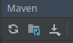
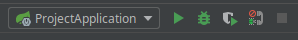

# Integration Assignment

## Setup

-   Pull project from github
-   Open (not import) the project with intellij
-   To build code use maven dashboard (ctrl+shift+A then search maven) clean then install
-   If you build via the maven project root, it builds for both project and endpoint
-   You might need to reimport or generate source the maven projects:


-   to run either of the two spring applications (project or data endpoint) just use intellij's build in runner:



## Build a small integration (import an exam)
- Create an endpoint (in data-endpoint/../DataEndpointController) that can be requested and return json.
- Create another exam endpoint (in assignment-project/../AssignmentController).
- The assignment endpoint should do the following:
    -   decode examId
    -   send request with examId to data endpoint
    -   map data response to the project response format
    -   return mapped data to requester
- The data and urls for the two endpoints should correspond to the two json models given below.

#### Extra
- Validate the json from the data endpoint and give a precise error message if the json is malformed or missing keys.


### Assignment project
#### Request:
##### url: localhost:8080/integration/assignment/exam/{examId}
```json
{
  "examId": "string",
  "title": "string",
  "startDate": "int",
  "endDate": "int",
  "participants": [
    {
      "participantId": "int",
      "firstName": "string",
      "lastName": "string"
    }
  ],
  "assessor": [
    {
      "assessorId": "int",
      "firstName": "string",
      "lastName": "string"
    }
  ]
}
```
#### startDate and endDate
- timestamps
### examId
- base64Encoded examId

### Data endpoint
#### Request 
##### url: localhost:8090/data/endpoint/exam/{examId}
```json
{
  "examId": "string",
  "title": "string",
  "startDate": "string",
  "endDate": "string",
  "users": [
    {
      "id": "int",
      "firstName": "string",
      "lastName": "string",
      "type": "int"
    }
  ]
}
```

#### type
- 0 => participant
- 1 => assessor

#### date
- yyyy-MM-dd

### examId
- decoded examId